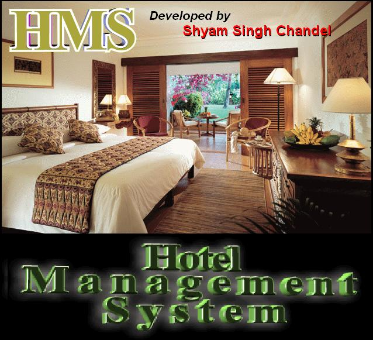



## Hotel Management System Multiuser

### Description

An application on Hotel Management System. It is a upgraded version. How to make multiuser and use it on many computers using

LAN. Install it on many computrs and map the path with any one computer. If any control is missing can be download from http://www.developerssourcecode.com/dsc/download_file.asp?intCodeID=144

Thanks

Shyam Singh Chandel
 
### More Info
 
no side effects.

             |
---                |---
**Submitted On**   |2009-05-27 02:34:18
**By**             |[ Shyam Singh Chandel](https://github.com/Planet-Source-Code/PSCIndex/blob/master/ByAuthor/shyam-singh-chandel.md)
**Level**          |Advanced
**User Rating**    |3.7 (11 globes from 3 users)
**Compatibility**  |VB 6\.0
**Category**       |[Complete Applications](https://github.com/Planet-Source-Code/PSCIndex/blob/master/ByCategory/complete-applications__1-27.md)
**World**          |[Visual Basic](https://github.com/Planet-Source-Code/PSCIndex/blob/master/ByWorld/visual-basic.md)
**Archive File**   |[Hotel\_Mana2158577272009\.zip](https://github.com/Planet-Source-Code/shyam-singh-chandel-hotel-management-system-multiuser__1-72310/archive/master.zip)

